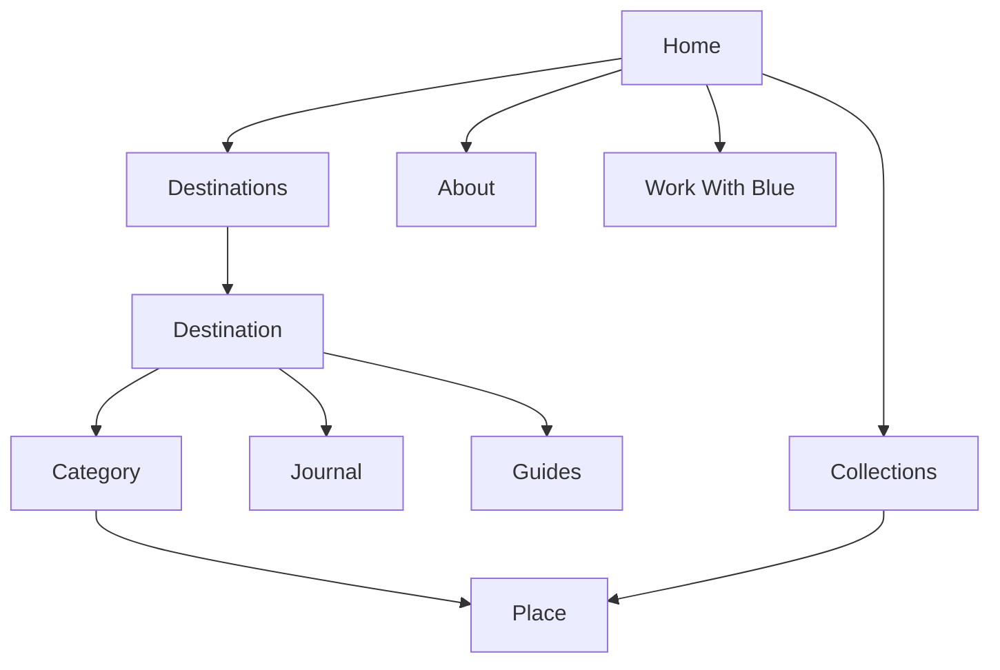
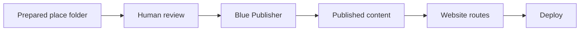
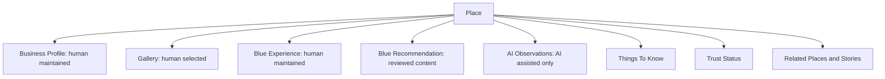
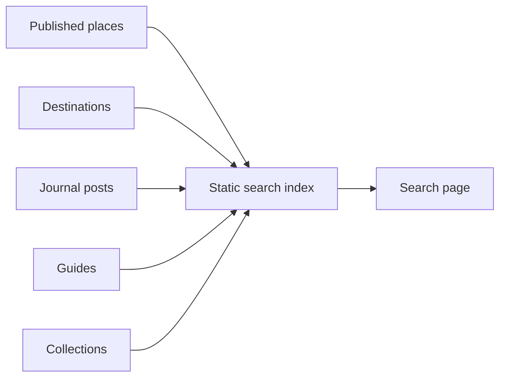

# Blue V2 Product Book

Status: Architecture source of truth  
Scope: Long-term refactor, not a rewrite  
Last updated: 2026-07-09

## 1. Product Positioning

Blue is a premium travel platform built around trusted places, destinations and editorial storytelling.

Blue should feel closer to a modern travel magazine than a software dashboard. The product should invite exploration first and reveal detailed trust information only when users open a place.

Core principle:

```text
Human-first.
AI-assisted.
Humans decide what gets published.
AI helps organize, review and assist.
```

Blue is not a booking platform, not a public review site and not an AI content farm. It is a curated trust layer for independent travelers.

## 2. Product Goals

1. Make Blue feel like a premium travel magazine.
2. Let users discover places naturally through destinations.
3. Keep the existing codebase, AI pipeline and publishing workflow wherever possible.
4. Move the main journey from recommendation search to destination exploration.
5. Establish a stable content model for every published place.
6. Make publishing simple enough for a one-person business.

## 3. Sitemap

Primary public sitemap:

```text
/
/destinations
/destinations/[destination]
/destinations/[destination]/[category]
/places/[place]
/journal
/journal/[story]
/guides
/guides/[guide]
/collections
/collections/[collection]
/about
/work-with-blue
```

Preserved routes:

```text
/recommended
/recommended/[slug]
/categories
/topics/[topic]
```

Route strategy:

- Keep existing routes to avoid broken URLs.
- Add new destination-first routes gradually.
- Later, `/recommended/[slug]` can alias or redirect to `/places/[place]`.
- `/recommended` can remain as an archive, but should not be the primary discovery path.

## 4. User Journey

The main journey becomes:

```text
Home
-> Destination
-> Category
-> Place
```

Example:

```text
Home
-> Egypt
-> Dahab
-> Diving
-> Fish & Friends
```

Another example:

```text
Home
-> Germany
-> Munster
-> Cafe
-> XYZ Cafe
```

Journey logic:

1. The user arrives for inspiration.
2. The user chooses a destination.
3. The user chooses a category inside that destination.
4. The user opens a place when they want detail.
5. The place page carries the full trust model.

## 5. Navigation

Recommended top navigation:

```text
Destinations
Places
Collections
Journal
Guides
About
Work With Blue
```

Navigation principles:

- The logo returns home.
- `Destinations` is the main entry.
- `Places` replaces the public meaning of `Recommended`.
- `Collections` supports inspiration and curated browsing.
- `Journal` supports destinations but is not the main product path.
- `Guides` supports practical travel planning.
- `About` explains trust.
- `Work With Blue` becomes a real page for partners.

## 6. Information Architecture

The hierarchy:

```text
Home
  Destination
    Category
      Place
```

Every place belongs to:

- one destination
- one country
- one city or local area
- one primary category
- optional tags
- optional collections
- optional related stories

Destination examples:

```text
Egypt
  Dahab
    Diving
      Fish & Friends

Germany
  Munster
    Cafe
      XYZ Cafe

Japan
  Tokyo
    Coffee
      Small local coffee shop
```

## 7. Page Hierarchy

### Home

Purpose:

Create emotion and invite exploration.

Recommended sections:

1. Large visual hero
2. Featured destinations
3. Featured places
4. Editorial stories
5. Collections
6. Work With Blue CTA

Avoid:

- long explanations
- system diagrams
- dense grids
- product documentation tone

### Destination Index

Route:

```text
/destinations
```

Purpose:

Show the world map of Blue without becoming a directory.

Recommended structure:

1. Editorial hero
2. Large destination cards
3. Featured collections
4. Latest destination stories

### Destination Page

Route:

```text
/destinations/[destination]
```

Purpose:

Turn each destination into a travel hub.

Recommended structure:

```text
Hero
Overview
Categories
Featured Places
Stories
Guides
Collections
```

Example:

```text
/destinations/dahab
```

### Category Page

Route:

```text
/destinations/[destination]/[category]
```

Purpose:

Let users browse intent-specific places within a destination.

Example:

```text
/destinations/dahab/diving
```

Recommended structure:

```text
Hero
Category context
Place cards
Related stories
Related guides
```

Keep it simple. Cards only. Detailed information belongs on the place page.

### Place Page

Route:

```text
/places/[place]
```

Preserved route:

```text
/recommended/[slug]
```

Purpose:

Show detailed trust information.

Required order:

```text
Business Profile
Gallery
Blue Experience
Blue Recommendation
AI Observations
Things To Know
Trust Status
Related Places
Related Stories
```

Note:

Sprint 48 currently displays a close order. The final V2 order should move Gallery immediately after Business Profile.

### Journal

Purpose:

Editorial storytelling that supports destinations.

Journal is not the main navigation model. Stories should appear inside destination pages and place pages as context.

### Guides

Purpose:

Practical evergreen knowledge.

Examples:

- How to choose a dive operator
- How to evaluate accommodation
- How to travel from airport to town
- SIM card notes
- Safety basics

### Collections

Purpose:

Curated thematic discovery.

Examples:

- Best Diving
- Weekend Escape
- Remote Work
- Budget Stay
- Hidden Cafes
- Road Trips

## 8. Content Model

Every published place should follow this structure:

```text
Place
  Business Profile
  Gallery
  Blue Experience
  Blue Recommendation
  AI Observations
  Things To Know
  Trust Status
  Related Places
  Related Stories
```

### Business Profile

Human maintained.

Fields:

```text
id
name
verified
category
destination
country
city
address
website
googleMaps
instagram
email
phone
openingHours
priceRange
languages
shortDescription
```

Rules:

- Never generated automatically by AI.
- Unknown fields remain `Not verified`.
- Visible signs do not become verified identities.

### Blue Experience

Human maintained.

Fields:

```text
visitedByBlue
visitDate
reviewer
blueRating
recommendedFor
highlights
cautions
editorNotes
```

Rules:

- Written by a human.
- Can be under review.
- May include cautions and missing information.

### Blue Recommendation

Reviewed content.

Source:

```text
recommendation.json
```

Rules:

- May be AI-assisted.
- Must be reviewed before publishing.
- Should read like editorial travel writing.

### AI Observations

AI-assisted only.

Source:

```text
ai-observations.json
```

Rules:

- Clearly labeled as photo observations.
- Never treated as verified business facts.
- Visible signs are observations only.

### Gallery

Human selected.

Rules:

- Images should be curated before publishing.
- Cover image should be chosen by a human.
- AI may suggest gallery order, but humans publish it.

### Trust System

Use existing Blue Trust System.

Trust states:

```text
Recommended
Verified
Under Review
Paused
```

## 9. Folder Structure

Current useful structure:

```text
app/
components/
content/posts/
lib/
tools/ai-content-generator/
public/images/
```

Recommended V2 published place structure:

```text
lib/published-recommendations/
  index.ts
  dahab-diving/
    business-profile.json
    blue-experience.json
    recommendation.json
    ai-observations.json
```

Future media structure:

```text
public/images/places/
  fish-friends-dahab/
    cover.jpg
    gallery-01.jpg
    gallery-02.jpg
    gallery-03.jpg
```

Future publisher input structure:

```text
publisher/input/
  fish-friends-dahab/
    metadata.json
    business-profile.json
    blue-experience.json
    story.md
    cover.jpg
    gallery/
      01.jpg
      02.jpg
      03.jpg
```

Future publisher output structure:

```text
lib/published-recommendations/
  fish-friends-dahab/
    business-profile.json
    blue-experience.json
    recommendation.json
    ai-observations.json

public/images/places/
  fish-friends-dahab/
    cover.jpg
    gallery-01.jpg
    gallery-02.jpg
```

## 10. Component Architecture

Existing components to keep:

```text
SiteHeader
SiteFooter
ImageGallery
BlueTrustSystem
PostCard
SectionHeading
```

Existing components to reorganize:

```text
RecommendationCollection
```

Split into reusable pieces later:

```text
PlaceCard
PlaceGrid
CategoryFilter
TrustBadge
DestinationCard
CollectionCard
StoryCard
```

Recommended future component tree:

```text
components/
  layout/
    site-header.tsx
    site-footer.tsx
  editorial/
    section-heading.tsx
    story-card.tsx
  destinations/
    destination-card.tsx
    destination-hero.tsx
    destination-category-nav.tsx
  places/
    place-card.tsx
    place-grid.tsx
    place-hero.tsx
    business-profile.tsx
    blue-experience.tsx
    blue-recommendation.tsx
    ai-observations.tsx
    things-to-know.tsx
  trust/
    blue-trust-system.tsx
    trust-badge.tsx
  media/
    image-gallery.tsx
```

Do not move everything at once. Create new components only when a page refactor needs them.

## 11. Publisher Architecture

Future publishing should be manual and simple.

Expected workflow:

```text
Prepare one folder
-> Drop folder into Blue Publisher
-> Click Publish
-> Generate images, JSON, routes, SEO, gallery, deploy
```

No AI article generation is required.

Publisher responsibilities:

1. Validate folder structure.
2. Copy images to public media folder.
3. Normalize image names.
4. Validate required JSON files.
5. Create published recommendation folder.
6. Register the place in the published index.
7. Generate route metadata.
8. Update search index.
9. Update collection memberships.
10. Prepare deploy.

Publisher should not:

- invent business facts
- rewrite human profile fields
- generate fake contact information
- publish unreviewed AI observations as verified facts

## 12. Search Architecture

Search should support:

```text
Destination
Place
Category
Country
Tags
Collections
Stories
```

Phase 1:

Static local search index generated at build time.

Search index shape:

```text
id
type
title
slug
destination
country
city
category
tags
summary
trustStatus
image
```

Search sources:

```text
published recommendations
destinations
collections
journal posts
guides
```

Phase 2:

Client-side search page:

```text
/search?q=dahab
```

Phase 3:

Add grouped results:

```text
Destinations
Places
Stories
Guides
Collections
```

No backend is required at first.

## 13. Collections Architecture

Collections are curated editorial groupings.

Examples:

```text
Best Diving
Weekend Escape
Remote Work
Budget Stay
Hidden Cafes
Road Trips
```

Collection model:

```text
id
slug
title
description
coverImage
places
stories
destinations
tags
featured
```

Recommended folder:

```text
lib/collections/
  index.ts
  best-diving.json
  remote-work.json
```

Collections should be manually curated. They should not be generated automatically from tags alone.

## 14. UI Principles

Blue V2 should feel:

```text
premium
minimal
editorial
visual-first
quiet
trustworthy
human
```

Design principles:

1. One screen, one message.
2. Large images before long text.
3. Place details only on place pages.
4. Destination pages should feel like travel hubs.
5. Category pages should be simple browsing surfaces.
6. Home should inspire, not explain.
7. About should explain trust.
8. Avoid dashboard patterns.
9. Avoid dense equal card walls unless browsing requires them.
10. Use progressive disclosure.

## 15. Mermaid Diagrams

### Site Hierarchy



### Publishing Workflow



### Place Content Layers



### Search Index



## 16. Migration Roadmap

### Phase 1: Stabilize Content Model

Goal:

Make the published place model the stable source of truth.

Tasks:

- Keep current recommendation data.
- Keep published recommendation workflow.
- Add missing model fields gradually.
- Keep old URLs working.
- Do not redesign UI.

### Phase 2: Introduce Place Language

Goal:

Shift product language from recommendations to places.

Tasks:

- Add `/places/[slug]`.
- Keep `/recommended/[slug]`.
- Reuse current place detail page.
- Add redirects or aliases later.
- Rename UI labels gradually.

### Phase 3: Destination Hub Refactor

Goal:

Make destination pages the main product surface.

Tasks:

- Upgrade `/destinations/[destination]`.
- Add categories.
- Show featured places.
- Pull related stories and guides.
- Keep existing destination data.

### Phase 4: Category Browsing

Goal:

Let users browse by intent inside a destination.

Tasks:

- Add `/destinations/[destination]/[category]`.
- Reuse `PlaceCard` and `PlaceGrid`.
- Keep detail content out of category pages.

### Phase 5: Homepage Refactor

Goal:

Make homepage a visual editorial gateway.

Tasks:

- Reduce explanation.
- Feature destinations.
- Feature places.
- Feature stories.
- Add collections.
- Keep Blue brand and visual system.

### Phase 6: Publisher Tool

Goal:

Make publishing simple and repeatable.

Tasks:

- Define input folder validation.
- Create local publish command.
- Copy images.
- Generate published folders.
- Update search index.
- Prepare deploy.

### Phase 7: Search and Collections

Goal:

Make discovery scalable.

Tasks:

- Build static search index.
- Add `/search`.
- Add `/collections`.
- Add collection pages.

## 17. Component Reuse Plan

Keep:

```text
AI Pipeline
Editorial Engine
Published Recommendation Workflow
Gallery
Trust System
Recommendation Data
Markdown
Existing Tailwind system
Existing page shell
```

Refactor slowly:

```text
RecommendationCollection -> PlaceGrid
Recommendation card markup -> PlaceCard
Destination cards -> DestinationCard
PostCard -> StoryCard variant
BlueTrustSystem -> Trust section for Place
```

Do not delete:

```text
/recommended
/recommended/[slug]
/journal
/journal/[slug]
existing markdown posts
existing published recommendation files
AI pipeline outputs
```

## 18. Non-Goals

Do not:

- rewrite the project
- remove existing functionality
- break existing URLs
- redesign pages independently
- optimize AI generation
- create a booking system
- create login
- create payment
- create a public review site

## 19. Immediate Next Sprint Recommendation

The highest-impact next implementation sprint:

```text
Create /places/[slug] as an alias of the current recommendation detail page,
while keeping /recommended/[slug] working.
```

Why:

- It shifts product language without deleting code.
- It preserves existing pages.
- It prepares the Home -> Destination -> Category -> Place hierarchy.
- It gives future refactors a stable destination.

Second sprint:

```text
Upgrade /destinations/dahab into the first real destination hub.
```

Third sprint:

```text
Add /destinations/dahab/diving as the first category page.
```

## 20. Final Principle

Blue V2 should not feel like:

```text
An AI recommendation database
```

It should feel like:

```text
A curated travel atlas where every place has a trust story.
```
