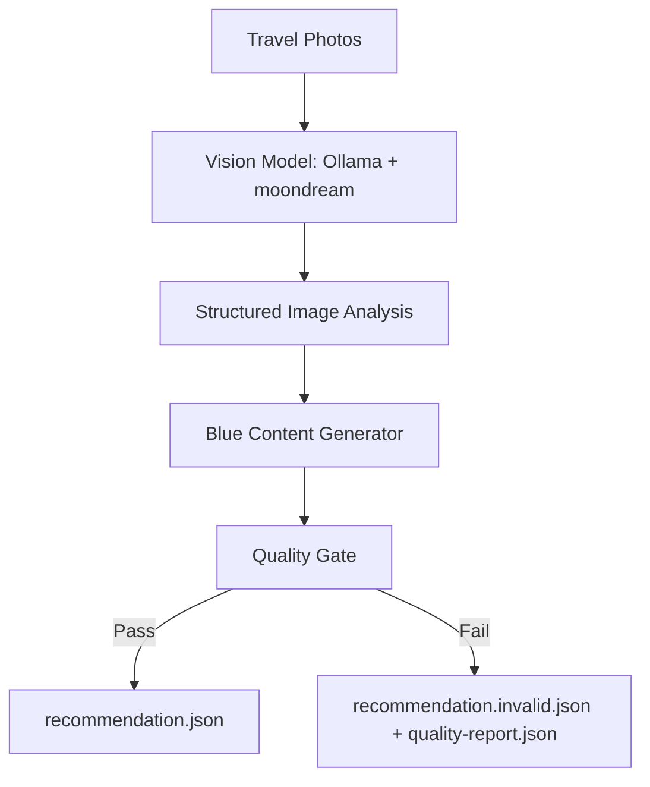

# Blue Local AI Pipeline

Sprint 26 turns the prototype into a local, provider-aware production pipeline.

The website is not part of this pipeline. The generator writes local draft files only.

## Pipeline Overview



## Step 1: Travel Photos

Photos are placed in:

```text
tools/ai-content-generator/input/
```

Supported formats:

- jpg
- jpeg
- png
- webp
- non-animated gif

HEIC is intentionally skipped for now.

## Step 2: Vision Model

The only model used for the offline workflow is:

```text
ollama / moondream
```

The vision model is not allowed to write marketing copy or recommendation prose.

Its only job is to describe visible facts:

- objects
- atmosphere
- colors
- environment
- activities
- confidence
- limitations

## Step 3: Structured Image Analysis

The model output must match:

```text
tools/ai-content-generator/schemas/image-analysis-schema.mjs
```

This creates a neutral fact layer between image understanding and editorial writing.

## Step 4: Blue Content Generator

The Blue generator is local code, not a paid API.

It creates:

- title
- summary
- whyBlueRecommends
- bestFor
- thingsToKnow
- tags

It can only use:

- editor-provided context
- image analysis facts
- source image filenames

## Step 5: Quality Gate

The quality gate rejects output when it detects:

- factual hallucinations
- missing required fields
- empty arrays
- placeholder values
- invalid categories
- duplicated text
- confidence below threshold
- unsupported gallery filenames

## Step 6: Output

Every successful run generates:

```text
recommendation.json
image-analysis.json
prompt.md
response.json
image-manifest.json
quality-report.json
run.log
REVIEW.md
```

If the quality gate fails, the generator saves diagnostic files but does not produce a production-ready `recommendation.json`.

## Local Command

```bash
node tools/ai-content-generator/generate-blue-recommendation.mjs \
  --photos tools/ai-content-generator/input/dahab-coffee \
  --destination Dahab \
  --country Egypt \
  --category Coffee \
  --provider ollama \
  --model moondream \
  --out tools/ai-content-generator/output/dahab-coffee
```

## Why This Structure Matters

The separation keeps Blue safer:

- the vision model sees but does not sell
- the content layer writes from facts only
- the quality gate blocks weak or risky output
- nothing is published automatically
